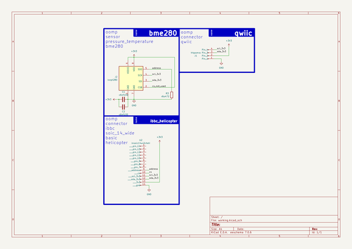
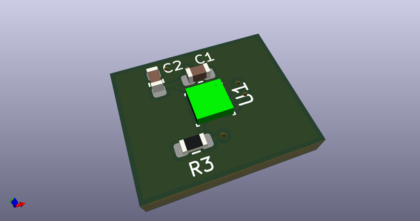
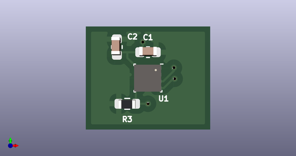
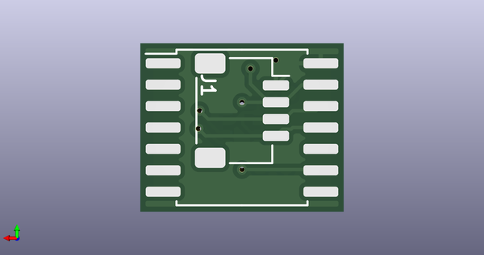
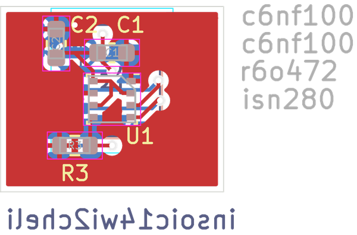
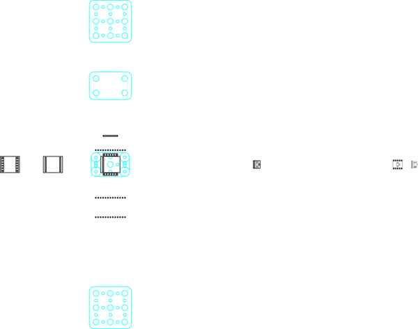

# 

## schematic  
  
[schematic.pdf](kicad/current_version/working/working_schematic.pdf)  

## pcb  
 
  
  
 

## corel working
 

## working_bom
| Id | Designator | Footprint | Quantity | Designation | Supplier and ref |  | None | 
| --- | --- | --- | --- | --- | --- | --- | --- | 
| 1 | C2,C1 | [electronic_capacitor_0603_100_nano_farad](https://github.com/oomlout/oomlout_oomp_part_src/tree/main/parts/electronic_capacitor_0603_100_nano_farad) | 2 | c6nf100 |  |  | [''] | 
| 2 | R3 | [electronic_resistor_0603_4700_ohm](https://github.com/oomlout/oomlout_oomp_part_src/tree/main/parts/electronic_resistor_0603_4700_ohm) | 1 | r6o472 |  |  | [''] | 
| 3 | U1 | [electronic_ic_lga_2_5_mm_x_2_5_mm_8_pin_sensor_pressure_temperature_bosch_bme280](https://github.com/oomlout/oomlout_oomp_part_src/tree/main/parts/electronic_ic_lga_2_5_mm_x_2_5_mm_8_pin_sensor_pressure_temperature_bosch_bme280) | 1 | isn280 |  |  | [''] | 
| 4 | J1 | [electronic_header_1_mm_jst_sh_4_pin_surface_mount_right_angle](https://github.com/oomlout/oomlout_oomp_part_src/tree/main/parts/electronic_header_1_mm_jst_sh_4_pin_surface_mount_right_angle) | 1 | h4psmra |  |  | [''] | 
| 5 | U2 | [electronic_interposer_soic_14_wide_i2c_helicopter](https://github.com/oomlout/oomlout_oomp_part_src/tree/main/parts/electronic_interposer_soic_14_wide_i2c_helicopter) | 1 | insoic14wi2cheli |  |  | [''] | 

