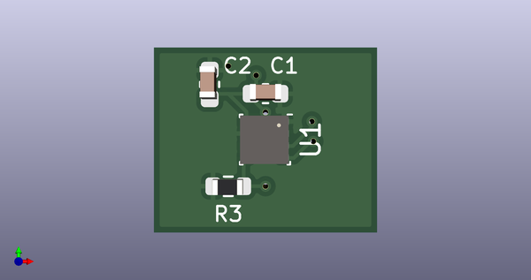
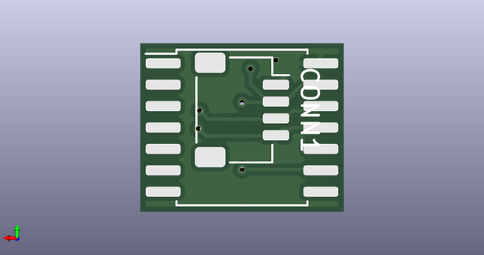

# 

## schematic  
  
[schematic (pdf)](kicad/current_version/working/working_schematic.pdf)  

## pcb  
 
  
  
  
[board (pdf)](kicad/current_version/working/working.pdf)  

## corel working
 

## working_bom
| Id | Designator | Footprint | Quantity | Designation | Supplier and ref |  | None | 
| --- | --- | --- | --- | --- | --- | --- | --- | 
| 1 | C2,C1 | [electronic_capacitor_0603_100_nano_farad](https://github.com/oomlout/oomlout_oomp_part_src/tree/main/parts/electronic_capacitor_0603_100_nano_farad/working) | 2 | c6nf100 |  |  | [''] | 
| 2 | R3 | [electronic_resistor_0603_4700_ohm](https://github.com/oomlout/oomlout_oomp_part_src/tree/main/parts/electronic_resistor_0603_4700_ohm/working) | 1 | r6o472 |  |  | [''] | 
| 3 | U1 | [electronic_ic_lga_2_5_mm_x_2_5_mm_8_pin_sensor_pressure_temperature_bosch_bme280](https://github.com/oomlout/oomlout_oomp_part_src/tree/main/parts/electronic_ic_lga_2_5_mm_x_2_5_mm_8_pin_sensor_pressure_temperature_bosch_bme280/working) | 1 | isn280 |  |  | [''] | 
| 4 | J1 | [electronic_header_1_mm_jst_sh_4_pin_surface_mount_right_angle](https://github.com/oomlout/oomlout_oomp_part_src/tree/main/parts/electronic_header_1_mm_jst_sh_4_pin_surface_mount_right_angle/working) | 1 | h4psmra |  |  | [''] | 
| 5 | U2 | [electronic_interposer_soic_14_wide_i2c_helicopter](https://github.com/oomlout/oomlout_oomp_part_src/tree/main/parts/electronic_interposer_soic_14_wide_i2c_helicopter/working) | 1 | insoic14wi2cheli |  |  | [''] | 

## oomp_parts_summary
| index | designator | quantity | oomp_id | 
| --- | --- | --- | --- | 
| 1 | C2,C1 | 2 | [electronic_capacitor_0603_100_nano_farad](https://github.com/oomlout/oomlout_oomp_part_src/tree/main/parts/electronic_capacitor_0603_100_nano_farad/working) [c6nf100](https://github.com/oomlout/oomlout_oomp_part_src/tree/main/parts/electronic_capacitor_0603_100_nano_farad/working) [LCSC - C14663 ](https://lcsc.com/product-detail/C14663.html)[LCSC - C30926 ](https://lcsc.com/product-detail/C30926.html) [Samsung - CL10B104KB8NNNC ](https://product.samsungsem.com/mlcc/CL10B104KB8NNN.do)[Yageo - CC0603KRX7R9BB104 ](https://www.yageo.com/en/Chart/Download/pdf/CC0603KRX7R9BB104) | 
| 2 | R3 | 1 | [electronic_resistor_0603_4700_ohm](https://github.com/oomlout/oomlout_oomp_part_src/tree/main/parts/electronic_resistor_0603_4700_ohm/working) [r6o472](https://github.com/oomlout/oomlout_oomp_part_src/tree/main/parts/electronic_resistor_0603_4700_ohm/working)   | 
| 3 | U1 | 1 | [electronic_ic_lga_2_5_mm_x_2_5_mm_8_pin_sensor_pressure_temperature_bosch_bme280](https://github.com/oomlout/oomlout_oomp_part_src/tree/main/parts/electronic_ic_lga_2_5_mm_x_2_5_mm_8_pin_sensor_pressure_temperature_bosch_bme280/working) [isn280](https://github.com/oomlout/oomlout_oomp_part_src/tree/main/parts/electronic_ic_lga_2_5_mm_x_2_5_mm_8_pin_sensor_pressure_temperature_bosch_bme280/working) [LCSC - C92489 ](https://lcsc.com/product-detail/C92489.html) [Bosch - BME280 ](https://www.bosch-sensortec.com/products/environmental-sensors/humidity-sensors-bme280/) | 
| 4 | J1 | 1 | [electronic_header_1_mm_jst_sh_4_pin_surface_mount_right_angle](https://github.com/oomlout/oomlout_oomp_part_src/tree/main/parts/electronic_header_1_mm_jst_sh_4_pin_surface_mount_right_angle/working) [h4psmra](https://github.com/oomlout/oomlout_oomp_part_src/tree/main/parts/electronic_header_1_mm_jst_sh_4_pin_surface_mount_right_angle/working) [LCSC - C145956 ](https://lcsc.com/product-detail/C145956.html)[LCSC - C2906270 ](https://lcsc.com/product-detail/C2906270.html) [JST - BM04B-SRSS-TB ](https://www.jst-mfg.com/product/index.php?series=231)[JST - SM04B-SRSS-TB ](https://www.jst-mfg.com/product/index.php?series=231) | 
| 5 | U2 | 1 | [electronic_interposer_soic_14_wide_i2c_helicopter](https://github.com/oomlout/oomlout_oomp_part_src/tree/main/parts/electronic_interposer_soic_14_wide_i2c_helicopter/working) [insoic14wi2cheli](https://github.com/oomlout/oomlout_oomp_part_src/tree/main/parts/electronic_interposer_soic_14_wide_i2c_helicopter/working)   | 

