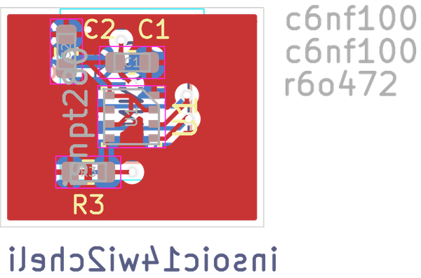

# 

## schematic  
  
[schematic (pdf)](kicad/current_version/working/working_schematic.pdf)  

## pcb  
 
  
  
  
[board (pdf)](kicad/current_version/working/working.pdf)  

## corel working
 

## working_bom
| Id | Designator | Footprint | Quantity | Designation | Supplier and ref |  | None | 
| --- | --- | --- | --- | --- | --- | --- | --- | 
| 1 | C2,C1 | [electronic_capacitor_0603_100_nano_farad](https://github.com/oomlout/oomlout_oomp_part_src/tree/main/parts/electronic_capacitor_0603_100_nano_farad/working) | 2 | c6nf100 |  |  | [''] | 
| 2 | R3 | [electronic_resistor_0603_4700_ohm](https://github.com/oomlout/oomlout_oomp_part_src/tree/main/parts/electronic_resistor_0603_4700_ohm/working) | 1 | r6o472 |  |  | [''] | 
| 3 | U1 | [electronic_ic_lga_2_5_mm_x_2_5_mm_8_pin_sensor_pressure_temperature_bosch_bme280](https://github.com/oomlout/oomlout_oomp_part_src/tree/main/parts/electronic_ic_lga_2_5_mm_x_2_5_mm_8_pin_sensor_pressure_temperature_bosch_bme280/working) | 1 | isn280 |  |  | [''] | 
| 4 | J1 | [electronic_header_1_mm_jst_sh_4_pin_surface_mount_right_angle](https://github.com/oomlout/oomlout_oomp_part_src/tree/main/parts/electronic_header_1_mm_jst_sh_4_pin_surface_mount_right_angle/working) | 1 | h4psmra |  |  | [''] | 
| 5 | U2 | [electronic_interposer_soic_14_wide_i2c_helicopter](https://github.com/oomlout/oomlout_oomp_part_src/tree/main/parts/electronic_interposer_soic_14_wide_i2c_helicopter/working) | 1 | insoic14wi2cheli |  |  | [''] | 

## oomp_parts_summary
| index | designator | quantity | oomp_id | 
| --- | --- | --- | --- | 
| 1 | C2,C1 | 2 | [electronic_capacitor_0603_100_nano_farad](https://github.com/oomlout/oomlout_oomp_part_src/tree/main/parts/electronic_capacitor_0603_100_nano_farad/working) [c6nf100](https://github.com/oomlout/oomlout_oomp_part_src/tree/main/parts/electronic_capacitor_0603_100_nano_farad/working) [Electronic Capacitor 0603 100 Nano Farad](https://github.com/oomlout/oomlout_oomp_part_src/tree/main/parts/electronic_capacitor_0603_100_nano_farad/working) [LCSC - C14663 ](https://lcsc.com/product-detail/C14663.html)[LCSC - C30926 ](https://lcsc.com/product-detail/C30926.html)[LCSC - C1591 ](https://lcsc.com/product-detail/C1591.html) [Samsung - CL10B104KB8NNNC](https://product.samsungsem.com/mlcc/CL10B104KB8NNN.do) [(L)  ](https://www.lcsc.com/search?q=CL10B104KB8NNNC)[(D)  ](https://www.digikey.com/en/products?keywords=CL10B104KB8NNNC)[(M)  ](https://www.mouser.com/Search/Refine?Keyword=CL10B104KB8NNNC)[(N)  ](https://www.newark.com/search?st=CL10B104KB8NNNC)[(SZ)  ](https://so.szlcsc.com/global.html?k=CL10B104KB8NNNC) [Yageo - CC0603KRX7R9BB104](https://www.yageo.com/en/Chart/Download/pdf/CC0603KRX7R9BB104) [(L)  ](https://www.lcsc.com/search?q=CC0603KRX7R9BB104)[(D)  ](https://www.digikey.com/en/products?keywords=CC0603KRX7R9BB104)[(M)  ](https://www.mouser.com/Search/Refine?Keyword=CC0603KRX7R9BB104)[(N)  ](https://www.newark.com/search?st=CC0603KRX7R9BB104)[(SZ)  ](https://so.szlcsc.com/global.html?k=CC0603KRX7R9BB104)  | 
| 2 | R3 | 1 | [electronic_resistor_0603_4700_ohm](https://github.com/oomlout/oomlout_oomp_part_src/tree/main/parts/electronic_resistor_0603_4700_ohm/working) [r6o472](https://github.com/oomlout/oomlout_oomp_part_src/tree/main/parts/electronic_resistor_0603_4700_ohm/working) [Electronic Resistor 0603 4700 Ohm](https://github.com/oomlout/oomlout_oomp_part_src/tree/main/parts/electronic_resistor_0603_4700_ohm/working) [LCSC - C25999 ](https://lcsc.com/product-detail/C25999.html)[LCSC - C105428 ](https://lcsc.com/product-detail/C105428.html) [Uniroyal - 0603WAJ0472T5E- not in jlc basic parts]() [(L)  ](https://www.lcsc.com/search?q=0603WAJ0472T5E)[(D)  ](https://www.digikey.com/en/products?keywords=0603WAJ0472T5E)[(M)  ](https://www.mouser.com/Search/Refine?Keyword=0603WAJ0472T5E)[(N)  ](https://www.newark.com/search?st=0603WAJ0472T5E)[(SZ)  ](https://so.szlcsc.com/global.html?k=0603WAJ0472T5E) [Uniroyal - 0603WAF4701T5E- jlc basic part]() [(L)  ](https://www.lcsc.com/search?q=0603WAF4701T5E)[(D)  ](https://www.digikey.com/en/products?keywords=0603WAF4701T5E)[(M)  ](https://www.mouser.com/Search/Refine?Keyword=0603WAF4701T5E)[(N)  ](https://www.newark.com/search?st=0603WAF4701T5E)[(SZ)  ](https://so.szlcsc.com/global.html?k=0603WAF4701T5E) [Yageo - RC0603JR-074K7L- available everywhere](https://www.yageo.com/en/Chart/Download/pdf/RC0603JR-074K7L) [(L)  ](https://www.lcsc.com/search?q=RC0603JR-074K7L)[(D)  ](https://www.digikey.com/en/products?keywords=RC0603JR-074K7L)[(M)  ](https://www.mouser.com/Search/Refine?Keyword=RC0603JR-074K7L)[(N)  ](https://www.newark.com/search?st=RC0603JR-074K7L)[(SZ)  ](https://so.szlcsc.com/global.html?k=RC0603JR-074K7L)  | 
| 3 | U1 | 1 | [electronic_ic_lga_2_5_mm_x_2_5_mm_8_pin_sensor_pressure_temperature_bosch_bme280](https://github.com/oomlout/oomlout_oomp_part_src/tree/main/parts/electronic_ic_lga_2_5_mm_x_2_5_mm_8_pin_sensor_pressure_temperature_bosch_bme280/working) [ilg8pbsnpt280](https://github.com/oomlout/oomlout_oomp_part_src/tree/main/parts/electronic_ic_lga_2_5_mm_x_2_5_mm_8_pin_sensor_pressure_temperature_bosch_bme280/working) [Electronic Ic Lga 2 5 Mm X 2 5 Mm 8 Pin Sensor Pressure Temperature Bosch Bme280](https://github.com/oomlout/oomlout_oomp_part_src/tree/main/parts/electronic_ic_lga_2_5_mm_x_2_5_mm_8_pin_sensor_pressure_temperature_bosch_bme280/working) [LCSC - C92489 ](https://lcsc.com/product-detail/C92489.html) [Bosch - BME280](https://www.sensortek.com.tw/index.php/en/products/mems-sensor/) [(L)  ](https://www.lcsc.com/search?q=BME280)[(D)  ](https://www.digikey.com/en/products?keywords=BME280)[(M)  ](https://www.mouser.com/Search/Refine?Keyword=BME280)[(N)  ](https://www.newark.com/search?st=BME280)[(SZ)  ](https://so.szlcsc.com/global.html?k=BME280)  | 
| 4 | J1 | 1 | [electronic_header_1_mm_jst_sh_4_pin_surface_mount_right_angle](https://github.com/oomlout/oomlout_oomp_part_src/tree/main/parts/electronic_header_1_mm_jst_sh_4_pin_surface_mount_right_angle/working) [h4psmra](https://github.com/oomlout/oomlout_oomp_part_src/tree/main/parts/electronic_header_1_mm_jst_sh_4_pin_surface_mount_right_angle/working) [Electronic Header 1 Mm Jst Sh 4 Pin Surface Mount Right Angle](https://github.com/oomlout/oomlout_oomp_part_src/tree/main/parts/electronic_header_1_mm_jst_sh_4_pin_surface_mount_right_angle/working) [LCSC - C145956 ](https://lcsc.com/product-detail/C145956.html)[LCSC - C2906270 ](https://lcsc.com/product-detail/C2906270.html) [JST - SM04B-SRSS-TB](https://www.jst-mfg.com/product/index.php?series=231) [(L)  ](https://www.lcsc.com/search?q=SM04B-SRSS-TB)[(D)  ](https://www.digikey.com/en/products?keywords=SM04B-SRSS-TB)[(M)  ](https://www.mouser.com/Search/Refine?Keyword=SM04B-SRSS-TB)[(N)  ](https://www.newark.com/search?st=SM04B-SRSS-TB)[(SZ)  ](https://so.szlcsc.com/global.html?k=SM04B-SRSS-TB)  | 
| 5 | U2 | 1 | [electronic_interposer_soic_14_wide_i2c_helicopter](https://github.com/oomlout/oomlout_oomp_part_src/tree/main/parts/electronic_interposer_soic_14_wide_i2c_helicopter/working) [insoic14wi2cheli](https://github.com/oomlout/oomlout_oomp_part_src/tree/main/parts/electronic_interposer_soic_14_wide_i2c_helicopter/working) [Electronic Interposer Soic 14 Wide I2C Helicopter](https://github.com/oomlout/oomlout_oomp_part_src/tree/main/parts/electronic_interposer_soic_14_wide_i2c_helicopter/working)   | 

Search Links: (L) - lcsc, (D) - digikey, (M) - mouser, (N) - newark, (SZ) - szlcsc

